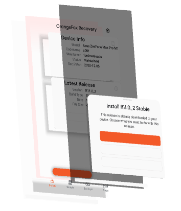

# OrangeFox App
App for <a href="https://wiki.orangefox.tech">OrangeFox Recovery</a> written on Java

## Features

* Downloading releases
* Get info about releases
* Update checking in background
* Backups/logs management
* OpenRecoveryScript creation
* Using API v3

## Used libraries

* [AndroidX](https://developer.android.com/jetpack/androidx)
* [Material Components](https://material.io)
* [AHBottomNavigation](https://github.com/aurelhubert/ahbottomnavigation)
* [SmartTabLayout](https://github.com/ogaclejapan/SmartTabLayout)
* [Facebook Shimmer](https://github.com/facebook/shimmer-android)
* [OkHttp](https://square.github.io/okhttp/)
* [HaulerView](https://github.com/futuredapp/hauler)
* [Overscroll Decor](https://github.com/EverythingMe/overscroll-decor)
* [libsu](https://github.com/topjohnwu/libsu)
* [LeakCanary](https://github.com/square/leakcanary)

## Build

You need installed Android Studio v4.1.1 and SDK 30

## License
GNU General Public License v3.0
